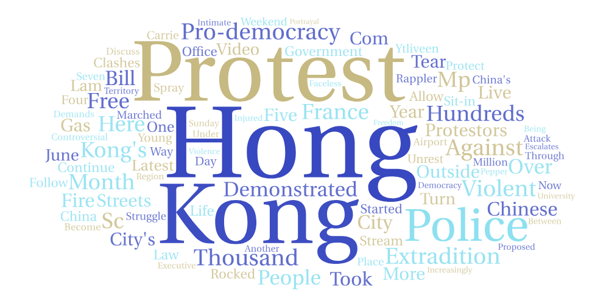

# search-data-comparison

## About

This project examines how the 2019 Hong Kong protests against a proposed extradition bill amendment are described on YouTube by analyzing the description text on videos returned when using the search term “hong kong protests 2019.” Data was collected using this same search term across three different locations: Shanghai, Hong Kong, and Taipei. For each location, the YouTube videos returned by the search were scraped, and the top 100 most frequently occurring words from the video description boxes were visualized using wordclouds. These 3 word clouds are used to compare how the same political event is discussed in different geographic contexts.

## Location Comparison
This comparison was conducted to explore whether geographic location influences how the Hong Kong protests are framed and described on YouTube. The three selected locations represent different distinct political and cultural perspectives: Shanghai, a major city within mainland China; Hong Kong, the site of the protests themselves; and Taipei, a city with a complex political relationship with China. By comparing the word usage in Youtube descriptions across these locations, this project aims to identify differences in emphasis and narrative regarding the protests that may reflect each location’s political environments or public opinion.

## Similarities and Differences & Possible Explainations 
Overall, the three word clouds share a strong core vocabulary, indicating that the videos across all locations are focused on the same event. The most prominent words in all three word clouds are “Hong,” “Kong,” and “Protest,” with other commonly shared terms being “Police” and “Demonstrated.” These similarities suggest a shared baseline understanding of the situation involving 2019 Hong Kong protests across all locations. Despite these similarities, notable differences appear in the frequency of certain terms. For example, the word “France” appears much more frequently in the Shanghai-based results than in the Hong Kong or Taipei results, suggesting a greater focus on international reactions to the protests within China. Additionally, while the term “pro-democracy” appears in all three word clouds, it is noticeably more prominent in video descriptions associated with Hong Kong and Taipei than in Shanghai. This difference is possibly explained by the complicated relationship these locations have with the Chinese Government, where issues regarding independence and democratic governance are more relevant to the public discourse. The Taipei wordcloud is also the only one that contains the words “Taiwan” and “Taipei” which suggests that the Hong Kong protests may have sparked discussions about the potential implications of the events towards Taiwan’s political future. Another subtle difference is that videos associated with Hong Kong and Taipei more often use the term “extradition,” whereas Shanghai-based results more frequently use “extradite”. This slight variation could be an indication that Hong Kong and Taipei based content focuses more on the political implications of the situation while Shanghai based content focuses more on the proposal actions.

## Future Improvements 
This research could be improved by utilizing more advanced text processing techniques, such as preserving certain specific key phrases or grouping similar words. This could make the extracted terms to be more relevant to the protests and reduce redundancy caused by variations in wording. Another aspect that could use improvement is filtering by time, focusing specifically on the Youtube videos published during the time period the protests were actively occurring. This would make it possible to analyze how language used to describe the political unrest in Hong Kong evolved in real time. Additionally, expanding the geographic scope to include more locations could provide a broader perspective and increase understanding of how a single political event can be depicted across the world. 

## Notable Observations
One aspect that stood out was how similar the top 100 words were across all three locations. While it is reasonable to expect a considerable amount of overlap when discussing a single event, I assumed there would be greater variation due to the distinct political situation in each of the locations. Instead, the differences across the word clouds were more subtle than expected and revealed that location itself did not influence how the Hong Kong protests were discussed to the extent I expected.

## WordClouds
### Shanghai Search Result Wordcloud

### Hong Kong Search Result Wordcloud

### Taipei Search Result Wordcloud

## Search Results csv Download Link
- [Search results for Shanghai](assets/hk-protests-SH-1.csv?raw=true)
- [Search results for Hong Kong](assets/hk-protests-HK-2.csv?raw=true)
- [Search results for Taipei](assets/hk-protests-TP-3.csv?raw=true)
